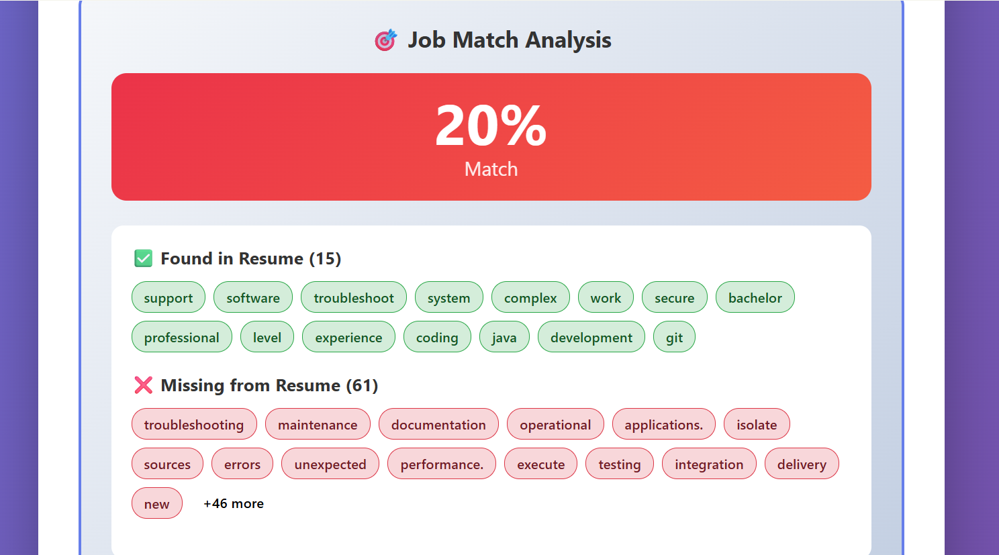

# Smart Resume Analyzer

Client-side web app that analyzes PDF resumes and provides explainable feedback similar to ATS-style screening.

**Live Demo:** https://perlathebian.github.io/resume-analyzer/

<p align="center">
  
</p>

---

## What It Does

- Extracts text from multi-page PDF resumes
- Detects key resume sections (Experience, Education, Skills, Summary)
- Extracts contact information (email + international phone formats)
- Scores resume quality using clear heuristics
- Optionally compares resumes to job descriptions
- Runs fully in-browser (no backend, no uploads)
- Modular code structure for maintainability and readability

---

## Why This Project Exists

Most resume tools are opaque or over-engineered.  
This project focuses on **clarity, explainability, and practical heuristics** under real ATS-like constraints.

---

## Architecture

```
UI (DOM)
  ↓
Controller (main.js)
  ↓
Core Analysis Modules
  ├─ modules/pdfParser.js
  ├─ modules/resumeAnalysis.js
  ├─ modules/scoring.js
  ├─ modules/jobComparison.js
  └─ modules/uiRenderer.js
```

Logic is now separated by responsibility into ES modules to keep the system readable, testable, and maintainable.

---

## Scoring Model (Explainable by Design)

```
Overall Score =
  Completeness (40%)
+ Contact Info (30%)
+ Language Quality (30%)
```

**Rationale**

- Missing sections are a common ATS rejection cause
- Contact information is critical and binary
- Action verbs signal impact and seniority

No machine learning is used — scoring is deterministic and explainable.

---

## Key Technical Decisions

### PDF Parsing

- Uses **PDF.js (Mozilla)** for consistent text extraction across formats

### Section Detection

- Keyword-based heading detection
- Favors transparency and speed over perfect accuracy

### Contact Extraction

- Regex-based email and phone parsing
- Phone detection supports international formats with digit-count validation

### Job Matching (Optional)

- Set-based keyword intersection
- Stop-word filtering to reduce noise
- MVP approach without black-box NLP

---

## Tech Stack

- JavaScript (ES6+) — async/await, Sets, ES Modules
- HTML / CSS
- PDF.js
- Browser APIs (FileReader, DOM)

No backend. No data persistence.

---

## Limitations

- Keyword matching is context-blind
- Creative section headings may not be detected
- PDF text order depends on document structure

These are documented tradeoffs.

---

## Future Improvements

- [ ] NLP-based section detection
- [ ] TF-IDF or embeddings for smarter job matching
- [ ] Python-based analysis engine
- [ ] Exportable reports
- [ ] TypeScript and tests

---

## Run Locally

```
git clone https://github.com/perlathebian/resume-analyzer
cd resume-analyzer

# If you have Python installed:
python -m http.server 8000

# If you have Node.js installed:
npx serve
``

Open http://localhost:8000 in your browser.

> **Note:** Make sure to serve via local server because ES modules require `type="module"` in your HTML `<script>` tags.
```
